# Phase-Locked Loop(PLL) IC design on Open-Source Google-Skywater 130nm Workshop
Phase-Locked Loop(PLL) IC design on Open-Source Google-Skywater 130nm Workshop

 - [Day 1: PLL Theory and Lab setup](#Day1)
  * [Part 1: Introduction to PLL](#Part1-Introduction-to-PLL)
  * [Part 2: Introduction to Phase Frequency Detector](#Part2-Introduction-to-Phase-Frequency-Detector)
  * [Part 3: Introduction to Charge Pump](#Part3-Introduction-to-Charge-Pump)
  * [Part 4: Introduction to Voltage Controlled Oscillator and Frequency Divider](#Part4-Introduction-to-Voltage-Controlled-Oscillator-and-Frequency-Divider)
  * [Part 5: Tool Setup and Design Flow](#Part5-Tool-Setup-and-Design-Flow)
  * [Part 6: Introduction to PDK, specifications and pre-layout circuits](#Part6-Introduction-to-PDK-specifications-and-pre-layout-circuits)
  * [Part 7: Circuit design simulation tool Ngspice Setup](#Part7-Circuit-design-simulation-tool-Ngspice-Setup)
  * [Part 8: Layout design tool Magic Setup](#Part8-Layout-design-tool-Magic-Setup)
- [Day 2: PLL Labs and post-layout simulations](#Day2)
  * [Part 9: PLL components circuit design](#Part9-PLL-components-circuit-design)
  * [Part 10: PLL components circuit simulations](#Part10-PLL-components-circuit-simulations)
  * [Part 11: Steps to combine PLL sub-circuits and PLL full design simulation](#Part11-Steps-to-combine-PLL-subcircuits-and-PLL-full-design-simulation)
  * [Part 12: Troubleshooting steps](#Part12-Troubleshooting-steps)
  * [Part 13: Layout design](#Part13-Layout-design)
  * [Part 14: Layout Walkthrough](#Part14-Layout-Walkthrough)
  * [Part 15: Parasitic Extraction](#Part15-Parasitic-Extraction)
  * [Part 16: Post Layout simulations](#Part16-Post-Layout-simulations)
  * [Part 17: Steps to combine layouts](#Part17-Steps-to-combine-layouts)
  * [Part 18: Tapeout theory](#Part18-Tapeout-theory)
  * [Part 19: Tapeout labs](#Part19-Tapeout-labs)


## Day1
The first day of the Workshop was dedicated towards acquainting us with the concepts related to PLL such as its internal components, their working, the uses of PLL and why it is advantageous over other methods of frequency generation. A brief introduction to the two softwaress; NgSPICE and Magic was also provided, along with installation and setup instructions.
![]theory/1.1PLL_internal_components.png)
## Part1 Introduction to PLL
Phase-locked loops (PLL) is a control system in which the output signal is based on the input signal and a feedback reference. It is used extensively to generate a precise clock signal with a clear spectrum (i.e., without phase or frequency noise), over a wide range of frequencies.

Quartz crystals and Voltage-Controlled Oscillators (VCO) can be used to generate clock pulse.
Quartz crystals have pure spectum but can only generate one frequency.
VCOs can be controlled with an input voltage signal. However, they tend to have noise in their frequency spectrum.

Intuition : PLLs mimics the reference frequency it is provided, while maintaining a clean frequency spectrum. Mimicking a reference frequency refers to producing output frequency which is either equal to or an integral multiple of the reference frequency.
## Part2 Introduction to Phase Frequency Detector
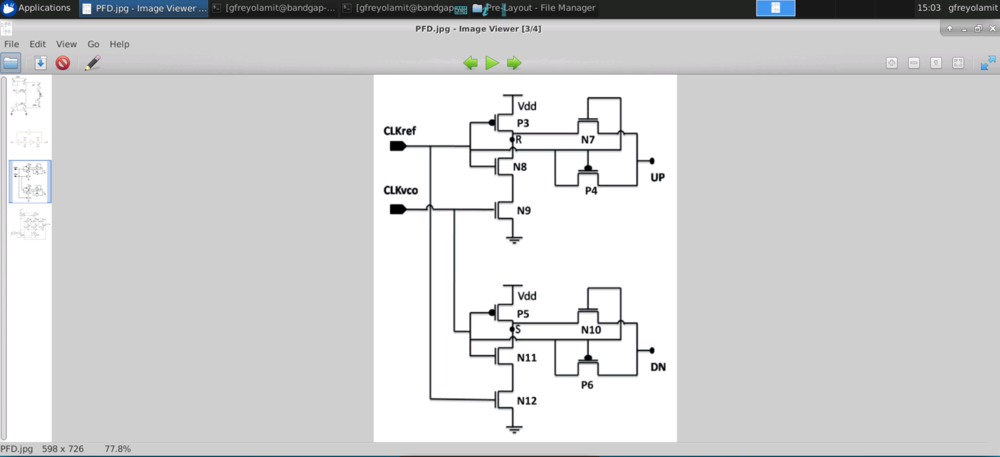
The Phase Frequency Detector (PFD) is used to compare the input reference signal and output feedback signal and generate a control signal. It measures the phase difference between Reference (REF) and Output (OUT) signal, using an XOR gate.
The XOR gate help us detect differences in phase, but we do not have an idea about whether the Output signal is leading or lagging the Reference.
This issue is resolved using 2 different outputs; UP and DOWN.
'Up' signal stays HIGH between falling edge of REF and falling edge of OUT.
'Down'signal stays HIGH between falling edge of OUT and falling edge of REF.
Dead Zone : If the 2 signals input the PFD are very close, i.e., separated by a very small difference in phase, then output waveform gets clipped. This zone is called 'Dead Zone'.
More sensitive PFD results in better PLL.


## Part3 Introduction to Charge Pump
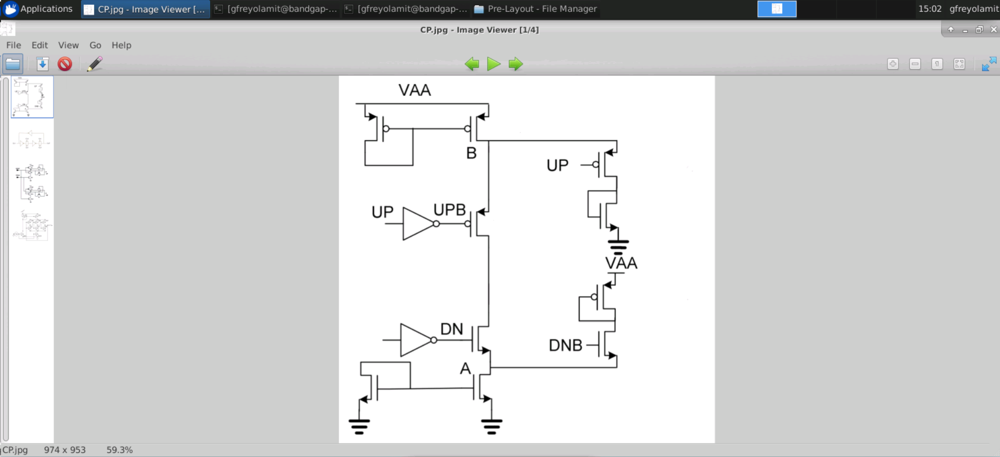
Charge Pump is defined as a kind of DC-to-DC converter that uses capacitors for energetic charge storage to raise or lower voltage.
They can be modelled as a combination of 2 ideal current sources, which are controlled by 2 switches.
In a PLL, it is used to convert the digital measure of phase/frequency difference into an analog signal to control the VCO.
The capacitor across the Output is used to smoothen the Output Voltage swing.
To further smoothen the voltage swing, a low-pass filter, called as Loop Filter, can be used.
Output of charge pump controls the VCO. Higher o/p voltage results in faster charging of VCO and hence higher frequency and vice-versa.
Assumptions : - Cx= C/10 - Loop filter bandwidth = 1/(1 + R.C1), where C1 = C . Cx / (C + Cx)
## Part4 Introduction to Voltage Controlled Oscillator and Frequency Divider
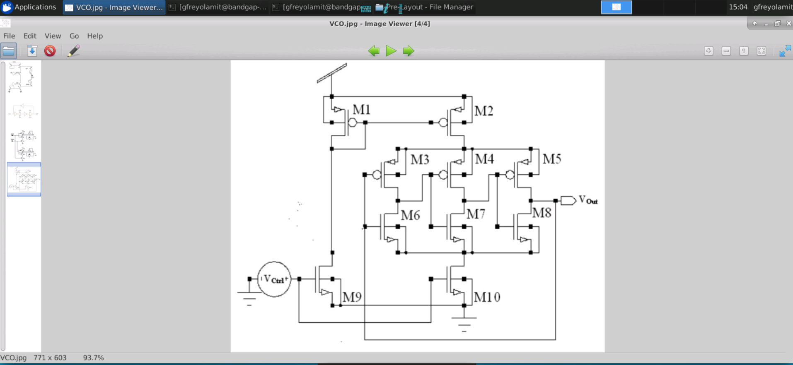
A voltage-controlled oscillator (VCO) is an electronic oscillator whose output frequency is proportional to its input voltage. An oscillator produces a periodic AC signal, and in VCOs, the oscillation frequency is determined by voltage.
Period = 2 * delay * no. of inverters, where delay is time taken to charge the output capacitor of charge pump.

Frequency depends on delay, which inturn is dependent on current supplied.

In the given 3 stage inverter, output flips by 'pi radians' in only half the oscillation period.
A frequency divider, also called a clock divider or scaler or prescaler, is a circuit that takes an input signal of a frequency, f, and generates an output signal of a frequency : nf, where n is some factor.

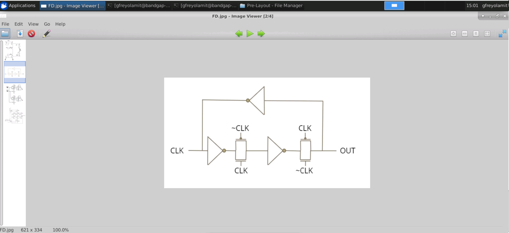
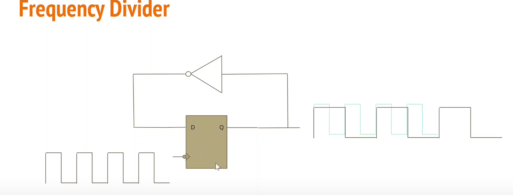
Implemented using a T flip-flop.

Output frequency of T flip-flop is half the frequency of the input signal.

IMPORTANT TERMS:

Lock range : Lock stage is defined as the stage where the o/p is mimicking the i/p. The range of frequencies over which the PLL is able to follow i/p frequency variations once loacked is called as lock range.

Capture range : The range of frequencies for which the PLL is able to attain a lock state from an unlocked state. It depends on filter bandwidth.

Lock range > Capture Range

Settling time : The time within which a PLL is able to attain a lock from an initially unlocked state. It depends on how quickly charge pump rises to its stable value.

## Part5 Tool Setup and Design Flow

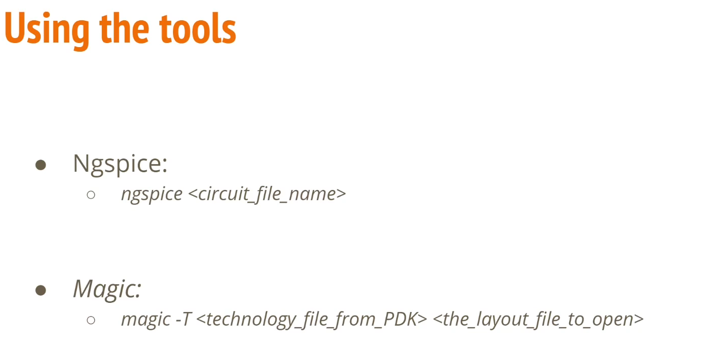
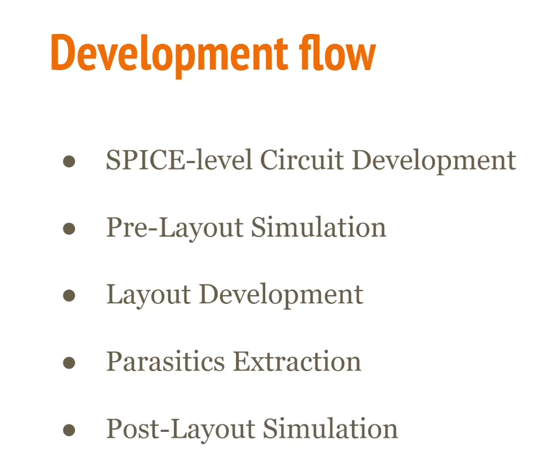
Advisable to build any software tool from its source code as it will be the latest version with all the updates and patches.

Tools used:

NgSPICE - Transistor-level circuit simulation
Magic - Parasitic design & extraction
Steps to install NgSPICE: Type sudo apt-get install ngspice in the Terminal.

Steps to install Magic:

To update the OS : sudo apt-get update && sudo apt-get upgrade
Clone the Magic Repository : git clone git://opencircuitdesign.com/magic
Install the csh shell : sudo apt-get install csh
Entering the correct directory : cd magic
./configure
make to compile.
sudo make install to install magic on the device.


## Part6 Introduction to PDK, specifications and pre-layout circuits
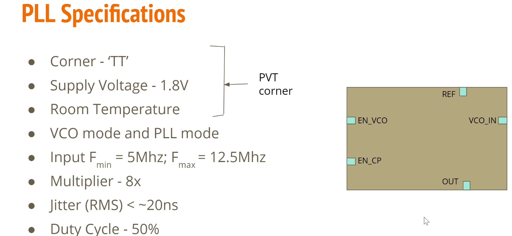
SKY130 PDK is used.
PDK or process design kit is a set of files used within the semiconductor industry to model a fabrication process for the design tools used to design an integrated circuit.
PDK conatins transistor characteristics and other information such as standard cells, their timing information, their layouts, corresponding Verilogs and so on.
Transistor characteristics :
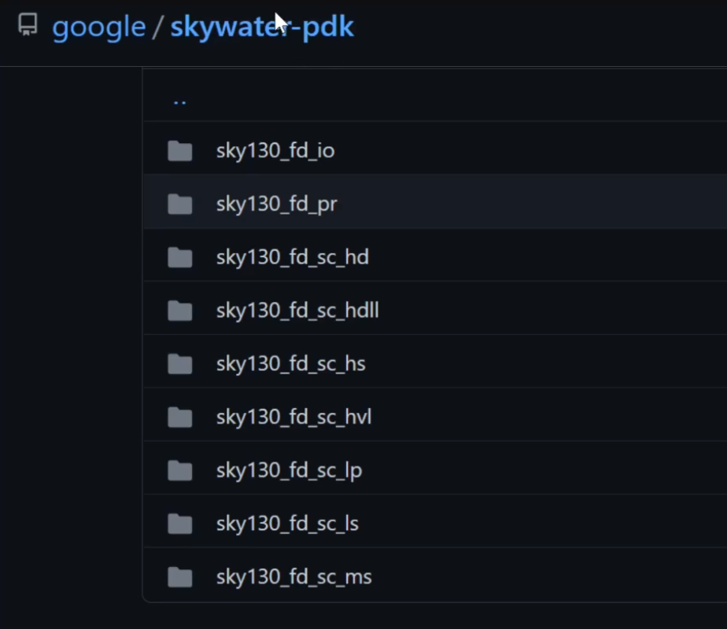

## Part7 Circuit design simulation tool Ngspice Setup
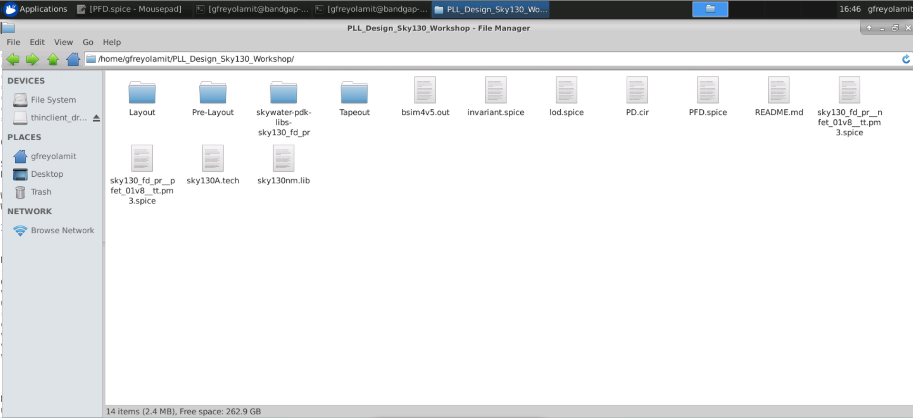

## Part8 Layout design tool Magic Setup


## Day2


## Part9 PLL components circuit design
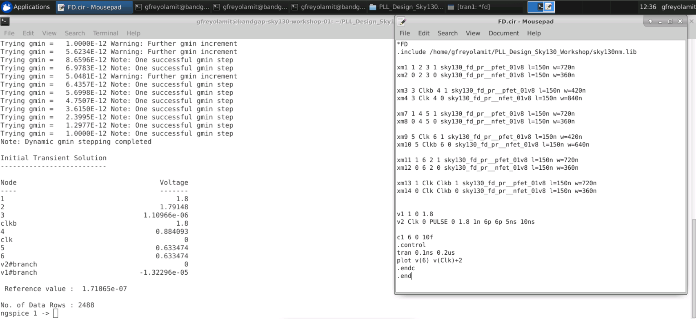

```
.include sky130nm.lib

xm1 1 2 3 1 sky130_fd_pr__pfet_01v8 l=150n w=720n 
xm2 0 2 3 0 sky130_fd_pr__nfet_01v8 l=150n w=360n 

xm3 3 Clkb 4 1 sky130_fd_pr__pfet_01v8 l=150n w=420n 
xm4 3 Clk 4 0 sky130_fd_pr__nfet_01v8 l=150n w=840n 

xm7 1 4 5 1 sky130_fd_pr__pfet_01v8 l=150n w=720n 
xm8 0 4 5 0 sky130_fd_pr__nfet_01v8 l=150n w=360n 

xm9 5 Clk 6 1 sky130_fd_pr__pfet_01v8 l=150n w=420n 
xm10 5 Clkb 6 0 sky130_fd_pr__nfet_01v8 l=150n w=640n 

xm11 1 6 2 1 sky130_fd_pr__pfet_01v8 l=150n w=720n 
xm12 0 6 2 0 sky130_fd_pr__nfet_01v8 l=150n w=360n 

xm13 1 Clk Clkb 1 sky130_fd_pr__pfet_01v8 l=150n w=720n 
xm14 0 Clk Clkb 0 sky130_fd_pr__nfet_01v8 l=150n w=360n 

v1 1 0 1.8
v2 Clk 0 PULSE 0 1.8 1n 6p 6p 5ns 10ns

c1 6 0 10f
.control
tran 0.1ns 0.2us
plot v(6) v(Clk)+2
.endc

.end
```
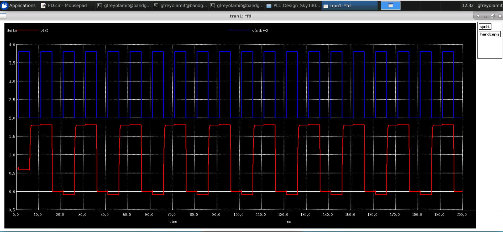
## Part10 PLL components circuit simulations
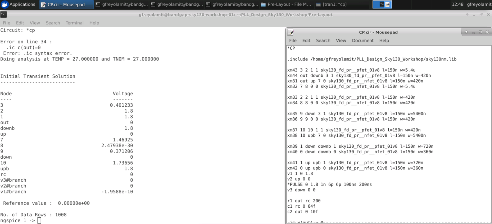
```
.include sky130nm.lib

xm43 3 2 1 1 sky130_fd_pr__pfet_01v8 l=150n w=5.4u 
xm44 out downb 3 1 sky130_fd_pr__pfet_01v8 l=150n w=420n 
xm31 out up 7 0 sky130_fd_pr__nfet_01v8 l=150n w=420n
xm32 7 8 0 0 sky130_fd_pr__nfet_01v8 l=150n w=5.4u

xm33 2 2 1 1 sky130_fd_pr__pfet_01v8 l=150n w=420n 
xm34 8 8 0 0 sky130_fd_pr__nfet_01v8 l=150n w=420n

xm35 9 down 3 1 sky130_fd_pr__pfet_01v8 l=150n w=5400n 
xm36 9 9 0 0 sky130_fd_pr__nfet_01v8 l=150n w=420n

xm37 10 10 1 1 sky130_fd_pr__pfet_01v8 l=150n w=420n 
xm38 10 upb 7 0 sky130_fd_pr__nfet_01v8 l=150n w=5400n

xm39 1 down downb 1 sky130_fd_pr__pfet_01v8 l=150n w=720n 
xm40 0 down downb 0 sky130_fd_pr__nfet_01v8 l=150n w=360n 

xm41 1 up upb 1 sky130_fd_pr__pfet_01v8 l=150n w=720n 
xm42 0 up upb 0 sky130_fd_pr__nfet_01v8 l=150n w=360n 
v1 1 0 1.8	
v2 up 0 0 
*PULSE 0 1.8 1n 6p 6p 100ns 200ns
v3 down 0 0

r1 out rc 200
c1 rc 0 64f
c2 out 0 10f

.ic v(out) = 0
.ic c(out) = 0
.control
tran 1ns 20us
plot v(out) C(out)
*plot v(6) V(Clk)+2
* v(D) v(Clk) v(6)
.endc

.end
```
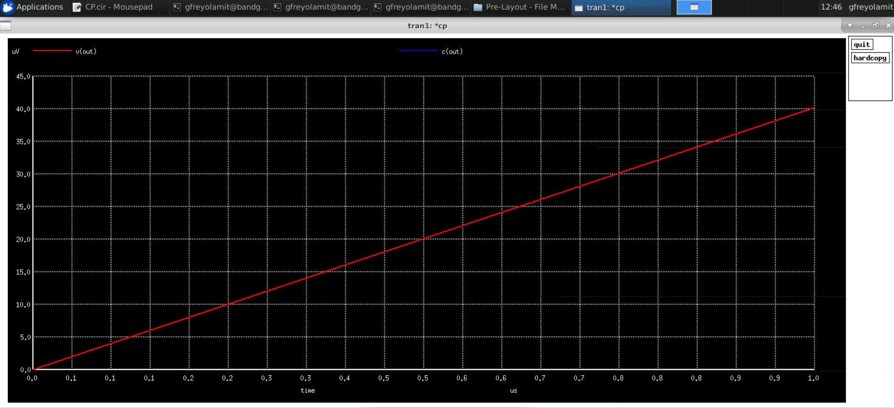
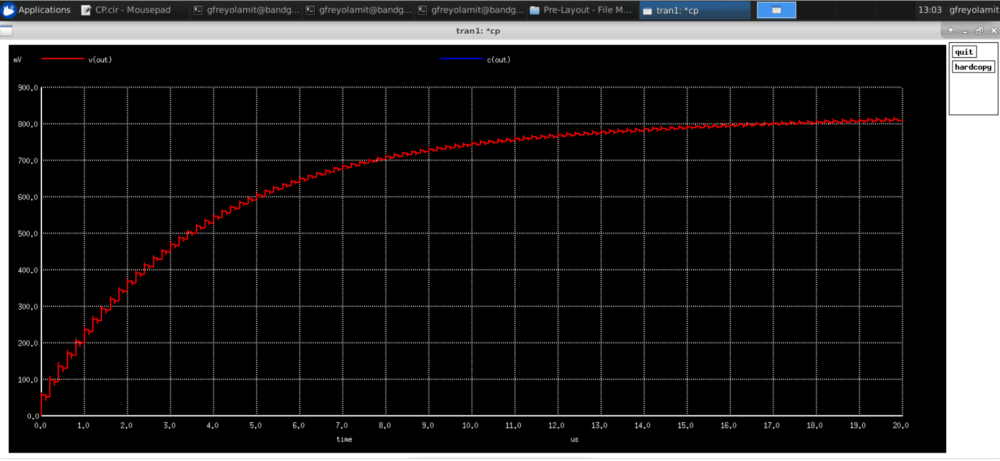
```
.include sky130nm.lib

xm1 10 16 3 10 sky130_fd_pr__pfet_01v8 l=150n w=420n
xm2 3 16 9 9  sky130_fd_pr__nfet_01v8 l=150n w=420n

xm3 10 3 4 10 sky130_fd_pr__pfet_01v8 l=150n w=420n
xm4 4 3 9 9 sky130_fd_pr__nfet_01v8 l=150n w=420n

xm5 10 4 12 10 sky130_fd_pr__pfet_01v8 l=150n w=420n
xm6 12 4 9 9 sky130_fd_pr__nfet_01v8 l=150n w=420n

xm11 10 12 13 10 sky130_fd_pr__pfet_01v8 l=150n w=420n
xm12 13 12 9 9 sky130_fd_pr__nfet_01v8 l=150n w=420n

xm13 10 13 14 10 sky130_fd_pr__pfet_01v8 l=150n w=420n
xm14 14 13 9 9 sky130_fd_pr__nfet_01v8 l=150n w=420n

xm15 10 14 15 10 sky130_fd_pr__pfet_01v8 l=150n w=420n
xm16 15 14 9 9 sky130_fd_pr__nfet_01v8 l=150n w=420n

xm17 10 15 16 10 sky130_fd_pr__pfet_01v8 l=150n w=2400n
xm18 16 15 9 9 sky130_fd_pr__nfet_01v8 l=150n w=1200n

xm7 10 5 1 1 sky130_fd_pr__pfet_01v8 l=150n w=1080n
xm8 5 5 1 1 sky130_fd_pr__pfet_01v8 l=150n w=840n
xm9 5 in 0 0 sky130_fd_pr__nfet_01v8 l=150n w=840n
xm10 9 in 0 0 sky130_fd_pr__nfet_01v8 l=150n w=1080n

xm19 1 16 11 1 sky130_fd_pr__pfet_01v8 l=150n w=1080n
xm20 11 16 0 0 sky130_fd_pr__nfet_01v8 l=150n w=540n

*c1 11 0 10f
v1 1 0 1.8
v2 in 0 0.6


.control
tran 0.1ns 0.5us
plot v(in) v(11)
*setplot tran1
*linearize v(14)
*set specwindow=blackman
*fft v(14)
*dc v2 0 1.2 0.01
*plot mag(v(14))
.endc
.end
```
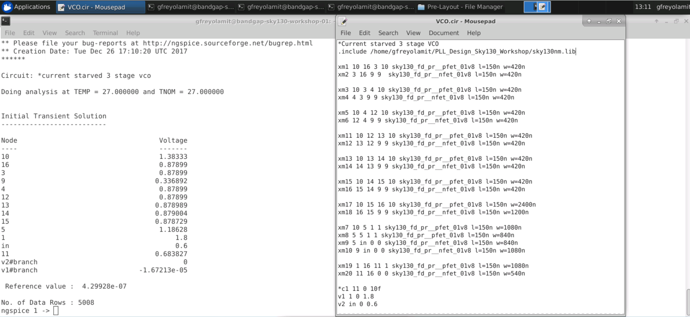
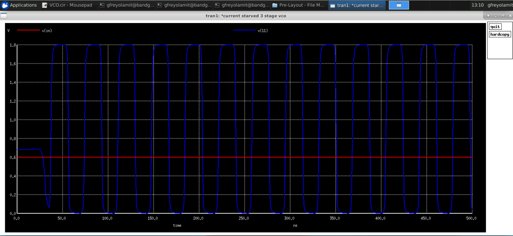
```
.include sky130nm.lib

xm1 1 2 3 1 sky130_fd_pr__pfet_01v8 l=150n w=720n 
xm2 0 2 3 0 sky130_fd_pr__nfet_01v8 l=150n w=360n 

xm3 3 Clkb 4 1 sky130_fd_pr__pfet_01v8 l=150n w=420n 
xm4 3 Clk 4 0 sky130_fd_pr__nfet_01v8 l=150n w=840n 

xm7 1 4 5 1 sky130_fd_pr__pfet_01v8 l=150n w=720n 
xm8 0 4 5 0 sky130_fd_pr__nfet_01v8 l=150n w=360n 

xm9 5 Clk 6 1 sky130_fd_pr__pfet_01v8 l=150n w=420n 
xm10 5 Clkb 6 0 sky130_fd_pr__nfet_01v8 l=150n w=640n 

xm11 1 6 2 1 sky130_fd_pr__pfet_01v8 l=150n w=720n 
xm12 0 6 2 0 sky130_fd_pr__nfet_01v8 l=150n w=360n 

xm13 1 Clk Clkb 1 sky130_fd_pr__pfet_01v8 l=150n w=720n 
xm14 0 Clk Clkb 0 sky130_fd_pr__nfet_01v8 l=150n w=360n 

v1 1 0 1.8
v2 Clk 0 PULSE 0 1.8 1n 6p 6p 5ns 10ns

c1 6 0 10f
.control
tran 0.1ns 0.2us
plot v(6) v(Clk)+2
.endc

.end
```
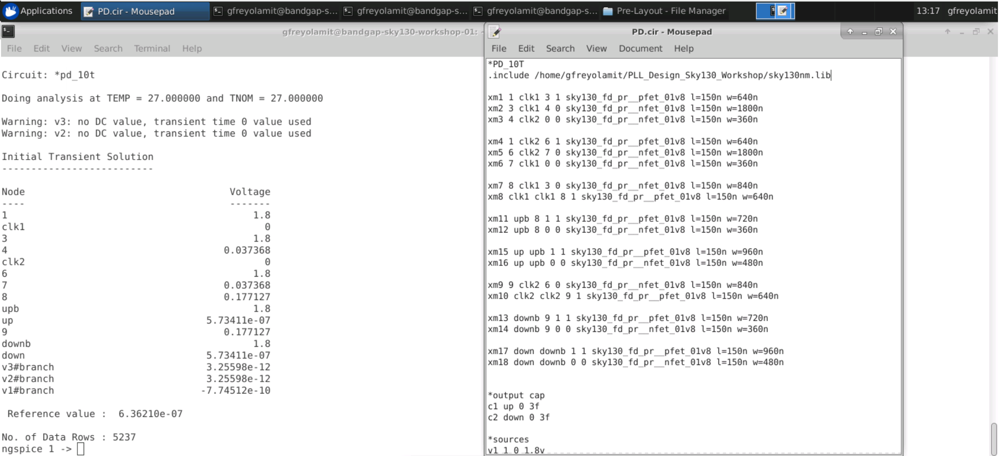
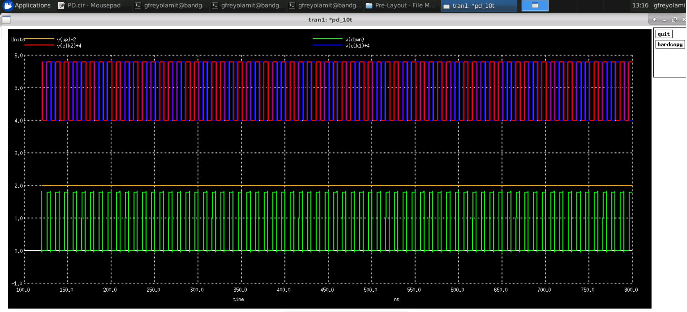
## Part11 Steps to combine PLL subcircuits and PLL full design simulation
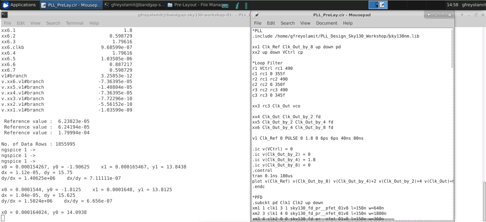
```
.include sky130nm.lib

xx1 Clk_Ref Clk_Out_by_8 up down pd
xx2 up down VCtrl cp

*Loop Filter
r1 VCtrl rc1 490
c1 rc1 0 355f
r2 rc1 rc2 490
c2 VCtrl 0 350f
r3 rc2 rc3 490
c3 rc3 0 345f
 
xx3 rc3 Clk_Out vco

xx4 Clk_Out Clk_Out_by_2 fd
xx5 Clk_Out_by_2 Clk_Out_by_4 fd
xx6 Clk_Out_by_4 Clk_Out_by_8 fd

v1 Clk_Ref 0 PULSE 0 1.8 0 6ps 6ps 40ns 80ns

.ic v(VCtrl) = 0
.ic v(Clk_Out_by_2) = 0
.ic v(Clk_Out_by_4) = 1.8
.ic v(Clk_Out_by_8) = 0
.control
tran 0.1ns 180us
plot v(Clk_Ref) v(Clk_Out_by_8) v(Clk_Out_by_4)+2 v(Clk_Out_by_2)+4 v(Clk_Out)+6 v(up)+8 v(down)+10 v(VCtrl)+12
.endc

*PFD
.subckt pd Clk1 Clk2 up down 
xm1 1 clk1 3 1 sky130_fd_pr__pfet_01v8 l=150n w=640n 
xm2 3 clk1 4 0 sky130_fd_pr__nfet_01v8 l=150n w=1800n
xm3 4 clk2 0 0 sky130_fd_pr__nfet_01v8 l=150n w=360n

xm4 1 clk2 6 1 sky130_fd_pr__pfet_01v8 l=150n w=640n 
xm5 6 clk2 7 0 sky130_fd_pr__nfet_01v8 l=150n w=1800n
xm6 7 clk1 0 0 sky130_fd_pr__nfet_01v8 l=150n w=360n

xm7 8 clk1 3 0 sky130_fd_pr__nfet_01v8 l=150n w=2400n 
xm8 clk1 clk1 8 1 sky130_fd_pr__pfet_01v8 l=150n w=640n

xm11 upb 8 1 1 sky130_fd_pr__pfet_01v8 l=150n w=720n
xm12 upb 8 0 0 sky130_fd_pr__nfet_01v8 l=150n w=360n

xm15 up upb 1 1 sky130_fd_pr__pfet_01v8 l=150n w=720n
xm16 up upb 0 0 sky130_fd_pr__nfet_01v8 l=150n w=360n
  
xm9 9 clk2 6 0 sky130_fd_pr__nfet_01v8 l=150n w=2400n
xm10 clk2 clk2 9 1 sky130_fd_pr__pfet_01v8 l=150n w=640n

xm13 downb 9 1 1 sky130_fd_pr__pfet_01v8 l=150n w=720n
xm14 downb 9 0 0 sky130_fd_pr__nfet_01v8 l=150n w=360n

xm17 down downb 1 1 sky130_fd_pr__pfet_01v8 l=150n w=720n
xm18 down downb 0 0 sky130_fd_pr__nfet_01v8 l=150n w=360n


*output cap
*c1 up 0 6f
*c2 down 0 6f

v1 1 0 1.8
.ends pd


*CP
.subckt cp up down out
xm43 3 2 1 1 sky130_fd_pr__pfet_01v8 l=150n w=18u 
xm44 out downb 3 1 sky130_fd_pr__pfet_01v8 l=150n w=420n 
xm31 out up 7 0 sky130_fd_pr__nfet_01v8 l=150n w=420n
xm32 7 8 0 0 sky130_fd_pr__nfet_01v8 l=150n w=4.8u

xm33 2 2 1 1 sky130_fd_pr__pfet_01v8 l=150n w=420n 
xm34 8 8 0 0 sky130_fd_pr__nfet_01v8 l=150n w=420n

xm35 9 down 3 1 sky130_fd_pr__pfet_01v8 l=150n w=5400n 
xm36 9 9 0 0 sky130_fd_pr__nfet_01v8 l=150n w=420n

xm37 10 10 1 1 sky130_fd_pr__pfet_01v8 l=150n w=420n 
xm38 10 upb 7 0 sky130_fd_pr__nfet_01v8 l=150n w=5400n

xm39 1 down downb 1 sky130_fd_pr__pfet_01v8 l=150n w=720n 
xm40 0 down downb 0 sky130_fd_pr__nfet_01v8 l=150n w=360n 

xm41 1 up upb 1 sky130_fd_pr__pfet_01v8 l=150n w=720n 
xm42 0 up upb 0 sky130_fd_pr__nfet_01v8 l=150n w=360n 

*r1 out rc 200
*c1 rc 0 8f

v1 1 0 1.8
.ends cp


*VCO
.subckt vco in 17
xm1 10 16 3 10 sky130_fd_pr__pfet_01v8 l=150n w=420n
xm2 3 16 9 9  sky130_fd_pr__nfet_01v8 l=150n w=420n

xm3 10 3 4 10 sky130_fd_pr__pfet_01v8 l=150n w=420n
xm4 4 3 9 9 sky130_fd_pr__nfet_01v8 l=150n w=420n

xm5 10 4 12 10 sky130_fd_pr__pfet_01v8 l=150n w=420n
xm6 12 4 9 9 sky130_fd_pr__nfet_01v8 l=150n w=420n

xm11 10 12 13 10 sky130_fd_pr__pfet_01v8 l=150n w=420n
xm12 13 12 9 9 sky130_fd_pr__nfet_01v8 l=150n w=420n

xm13 10 13 14 10 sky130_fd_pr__pfet_01v8 l=150n w=420n
xm14 14 13 9 9 sky130_fd_pr__nfet_01v8 l=150n w=420n

xm15 10 14 15 10 sky130_fd_pr__pfet_01v8 l=150n w=420n
xm16 15 14 9 9 sky130_fd_pr__nfet_01v8 l=150n w=420n

xm17 10 15 16 10 sky130_fd_pr__pfet_01v8 l=150n w=2400n
xm18 16 15 9 9 sky130_fd_pr__nfet_01v8 l=150n w=1200n

xm7 10 5 1 1 sky130_fd_pr__pfet_01v8 l=150n w=1080n
xm8 5 5 1 1 sky130_fd_pr__pfet_01v8 l=150n w=840n
xm9 5 in 0 0 sky130_fd_pr__nfet_01v8 l=150n w=840n
xm10 9 in 0 0 sky130_fd_pr__nfet_01v8 l=150n w=1080n

xm19 1 16 11 1 sky130_fd_pr__pfet_01v8 l=150n w=720n
xm20 11 16 0 0 sky130_fd_pr__nfet_01v8 l=150n w=360n

xm21 1 11 17 1 sky130_fd_pr__pfet_01v8 l=150n w=720n
xm22 17 11 0 0 sky130_fd_pr__nfet_01v8 l=150n w=360n

*c1 11 0 24f
v1 1 0 1.8
.ends vco


*FD
.subckt fd Clk 10

xm1 1 2 3 1 sky130_fd_pr__pfet_01v8 l=150n w=720n 
xm2 0 2 3 0 sky130_fd_pr__nfet_01v8 l=150n w=360n 

xm3 3 Clkb 4 1 sky130_fd_pr__pfet_01v8 l=150n w=420n 
xm4 3 Clk 4 0 sky130_fd_pr__nfet_01v8 l=150n w=840n 

xm7 1 4 5 1 sky130_fd_pr__pfet_01v8 l=150n w=720n 
xm8 0 4 5 0 sky130_fd_pr__nfet_01v8 l=150n w=360n 

xm9 5 Clk 6 1 sky130_fd_pr__pfet_01v8 l=150n w=420n 
xm10 5 Clkb 6 0 sky130_fd_pr__nfet_01v8 l=150n w=640n 

xm11 1 6 2 1 sky130_fd_pr__pfet_01v8 l=150n w=720n 
xm12 0 6 2 0 sky130_fd_pr__nfet_01v8 l=150n w=360n 

xm13 1 Clk Clkb 1 sky130_fd_pr__pfet_01v8 l=150n w=720n 
xm14 0 Clk Clkb 0 sky130_fd_pr__nfet_01v8 l=150n w=360n 

xm15 7 6 1 1 sky130_fd_pr__pfet_01v8 l=150n w=720n 
xm16 7 6 0 0 sky130_fd_pr__nfet_01v8 l=150n w=360n

xm19 1 7 10 1 sky130_fd_pr__pfet_01v8 l=150n w=720n
xm20 10 7 0 0 sky130_fd_pr__nfet_01v8 l=150n w=360n 


*c1 7 0 18f
v1 1 0 1.8
.ends fd
.end
```

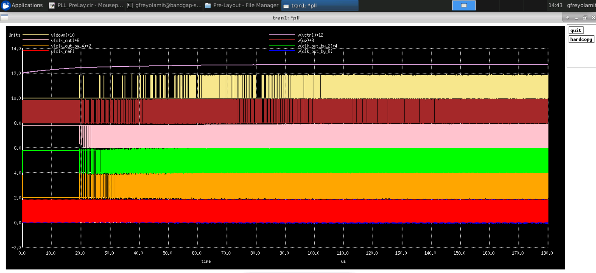
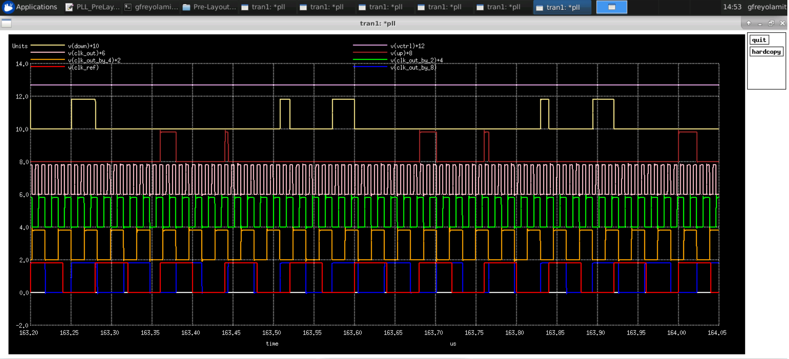
## Part12 Troubleshooting steps
Observe the kinds of issue faced.
Debug individual components fully before trying to debug the combined simulation.
Check if any signals are coming flat or if the simulation is crashing. If this is the case then check if all the connections are done properly. Also check if there are any issues like wrong naming, capitalization issues or parameter value issues.
If the signals are right but the mimicking is not happening then verify the following:
For what range of frequencies is the VCO working properly: Is our required output frequency range lying in the VCO's working range.
Is the Phase Frequency Detector able to detect the differences: If the phase difference is very small, the PFD might not be able to detect it.
Is the rate of Charge Pump output charging and discharging fast: Is it too fast or too slow? Is there too much fluctuations in charging or discharging? This means that the transistor sizing is the thing to pay attention to. Check the response of the CP when 0V is given as the input. If it is still charging then the charge leakage is the issue.
Whether the loop filter values are working out: This can be found out using the thumb rules.
## Part13 Layout design
The way to draw here in magic is first to make a box and then fill it with a material.

By left clicking, we fix the left bottom corner of the box.

By right clicking, we fix the right top corner of the box.

If we hover upon a layer (layers panel is present on the right hand side of the window), we can see the name of the layer on the top right corner of the screen.

By middle clicking on a layer, the box gets filled by the selected layer.

Materials needed for the transistors:

P-diffusion for the PMOS and N-diffusion for the NMOS.
For the gate, polysilicon layer is needed.
DRC error means that there is a size issue or a closeness issue. To know what exactly the issue is, select some part of the error region and press the "?" button on the keyboard and then the error will show up on the "magic command window".

Before creating a PMOS, we must create an N-Well region and then place the PMOS over it.

To copy a transistor, make a box around the transistor and press "A" button on the keyboard. Now, place the cursor where we wish to copy it and press "C" button. If we press the "M" button then it becomes the move operation.

For placing Vdd and ground, place the metal1 layer.

To connect two transistors, use the loacal interconnect layer (locali) like a wire.

To connect two layers, look for contact layers in the tray. They are represented with a cross symbol.

As long as we do not connect a contact, two different layers will not touch even if they overlap.

If we get a DRC error at this point it means that either the size of the contact is too small or the region of metal1 and local interconnect around the contact is not enough.

To create a label, draw a line around the edge of the layer that we want to label. A line is drawn by making a box of zero thickness. Type the command label name in the magic command window. Name can be any name to be used as label.

To make a port, draw a box around the label and type port make in the magic command window.

We need to make ports because when we extract the parasitics from our design, the input and output ports will automatically have these names as we have labelled them as ports.
## Part14 Layout Walkthrough


Open the magic (.mag) files for the previously designed circuits:
Frequency Divider
Phase Frequency Detector
On the right side, there are two similar drawings on the top and on the bottom, which are additional buffers required for getting full swing.
Charge Pump
Top most long transistor is just for enabling or disabling the charge pump.
Right below it is the upper current source. This much difference in the size of the transistor for the current source is to allow maximum current for the charging and discharging process.
Two inverters on the left create the UPz and the DOWNz signals (UPz = up bar and DOWNz = down bar or their inverted variants).
Voltage Controlled Oscillator
There are seven inverters to reduce the range of frequencies that we are dealing with.
There is an additional inverter at the end which helps to obtain a full swing for the output.
At the top there is a small PMOS that acts as an enable or disable for the VCO.
Assessment Question
Copy the "FD.mag" file in the directory where the technology file "sky130A.tech" is placed.
Open the Terminal in this directory.
Open the FD layout file. Type magic -T sky130A.tech FD.mag in the Terminal.
The layout looks something like this.
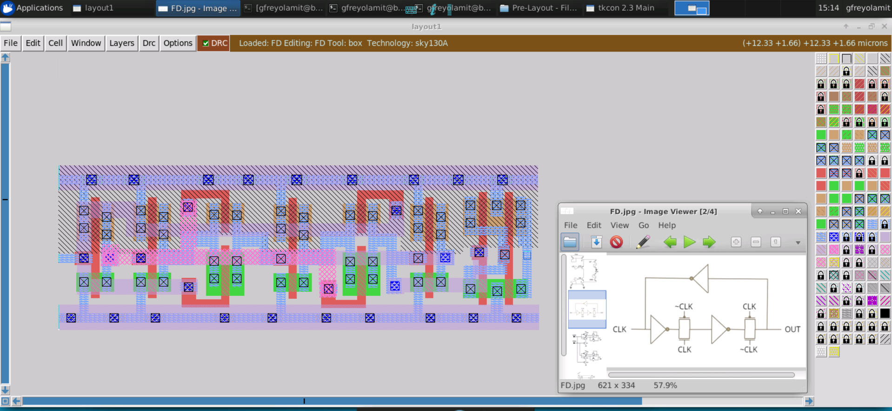
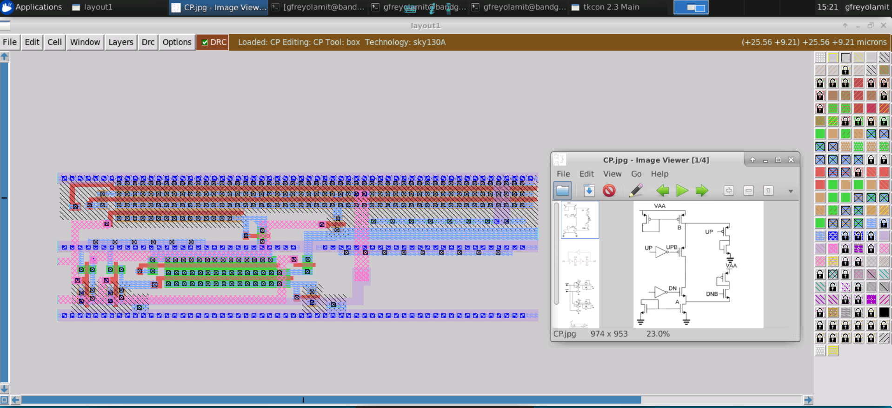
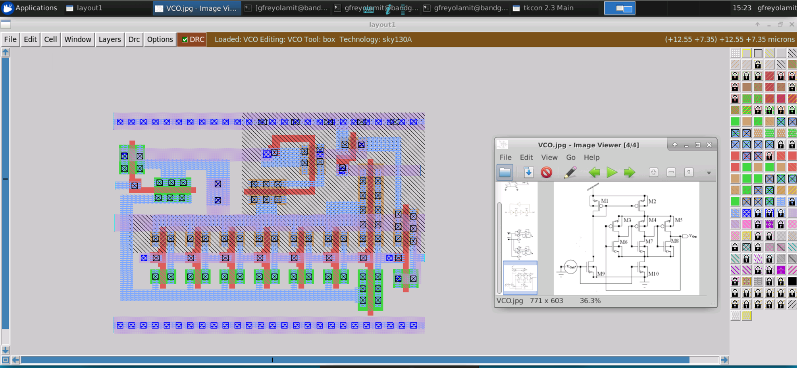
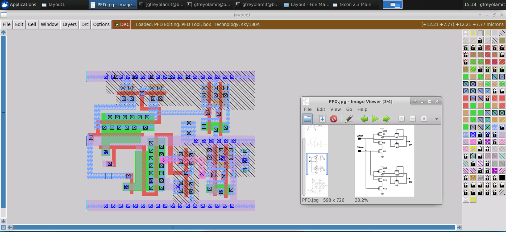
Now left-click on the bottom left-corner of the layout and right-click on the top right-corner of the layout.
Go to the Magic Terminal and type box command, which gives the area.

The area in sq. um is given as 29.70 and hence it is the answer.
## Part15 Parasitic Extraction
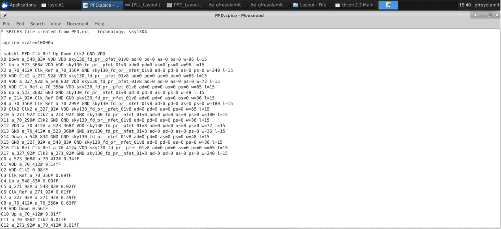
## Part16 Post Layout simulations
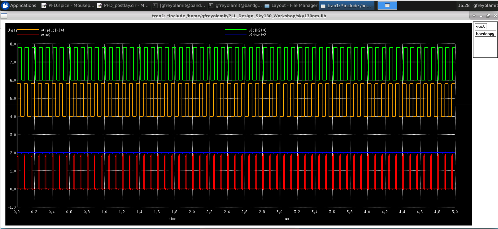
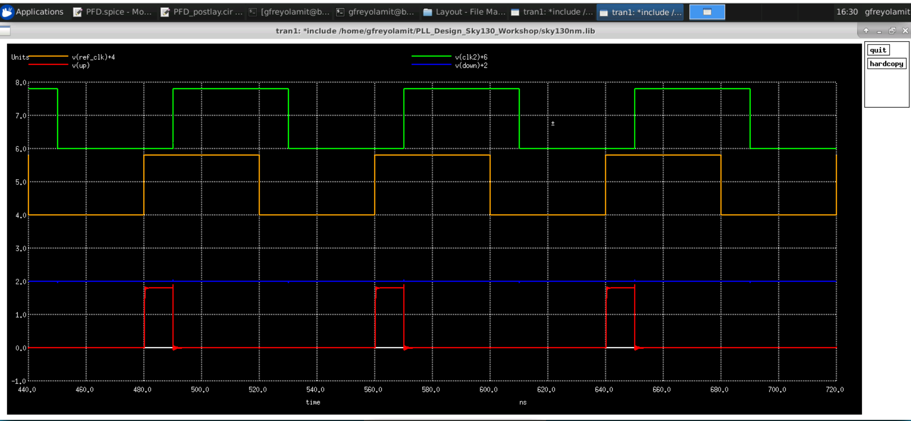
## Part17 Steps to combine layouts
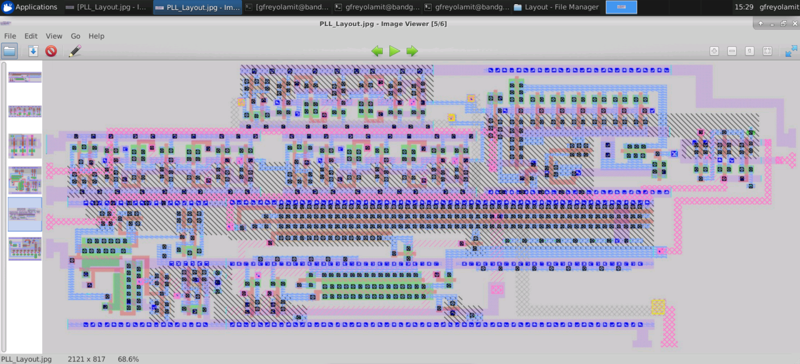
Open Magic using the command magic -T sky130A.tech in the Terminal.
Use 'place instance' options present in 'cells'. The 'place instace' is used to place one or more pre-created circuit layouts in the Magic window.
Press the "I" button and then the "X" button on the keyboard to open the circuit or to make the circuit visible.
Now open all layouts in the same window.
Make quick connections using the wire tool. To access the wire tool press the space bar once and to exit the wire tool press the space bar three more times.
Extend the layers to make connections between the subcircuits.
In the final PLL design:

On the right hand side, there is a multiplexer. It is kept to select between the charge pump or an external source to control the VCO.

On the top left, there are three frequency dividers. The output from them is the feed-back loop and it goes to the PFD on the bottom left.

The PFD also has the reference clock as input. PFD converts the inputs into the Up or Down signals that control the charge pump at the bottom right.

The output voltage generated by the charge pump in turn controls the VCO and generates the output that we want.

After Charge Pump, we must place the loop filter.

Extract spice netlist and perform the final post layout simulation.

Save that file as a "GDS" file.

The GDS file is the complete layout information that we can send to the fabrication centre to fabricate the IC.
To write GDS file, go to the file menu and choose the "Write GDS" option.
This gives us our final IC design in ".gds" format.
The final PLL layout looks as follows:
## Part18 Tapeout theory

Tapeout means to send our final design to the Fab, after 'preparing' it.
Steps required in preparing the chip: 
Caravel Caravel is a template SoC for Efabless Open MPW and chipIgnite shuttles based on the Sky130 node from SkyWater Technologies. 

The user project area we see is the area available to us to place our design.
This is the IC that finally gets fabricated with our design inside it.
During the first shuttle, the process was to place and design inside the user project area and then meet the connections from the design ports to the user project area pins and then merge that user project area into the Caravel SoC.
## Part19 Tapeout labs

Download the layout file for the analog user project area.

Once downloaded, extract it to the directory of your choice.

Now, open it with magic and the technology file sky130A.tech

Place the design in the user project area and make the connections with the pins.

It is important to not that one must not move any of the pins that they have given from their location. We only use the pins that we need and connect our design to them.

At the bottom of the user project area are the wishful ports.

Along the left of the user project area are the input-output ports and some power ports like Vdd and Vss.

Along the right of the user project area are a few more input-output ports and power ports like Vccd, Vssd, Vcca and Vssa.

At the top of the user project area are the analog input-output pins.

In our design, we have five pins:

Enable pins for CP and VCO.
Reference clock input pin.
Output clock pin.
VCO direct input pin.
The enable pins are connected to the digital input-output pins.

Reference clock input pin and output clock pin are also digital and so we connect them to the digital input-output pins.

VCO direct input pin is control voltage pin of analog nature. So, we need to connect it to an analog input-output pin.

Considering this scenarion, we place our design at the top-right corner and make the connections to the pins using wire tool and contact layers.
## Acknowledgement
1. Kunal Ghosh, Co-founder, VSD Corp. Pvt. Ltd. - kunalpghosh@gmail.com
2. Lakshmi S., MS, Giorgia Institute of Technology
## Conclusion
The 2-Day Workshop on Phase-Locked Loop(PLL) IC design introduces its participants to the basics of IC design process, which is particularly important for students and professionals, who intend to pursue a career in Physical Design. The Workshop had a good balance between the theory and practicals. The lectures were short and informative and the labs were sufficiently challenging. The inclusion of assessments at the end was also a good for revision. The overall rigour and depth of the Workshop is highly appreciable.
